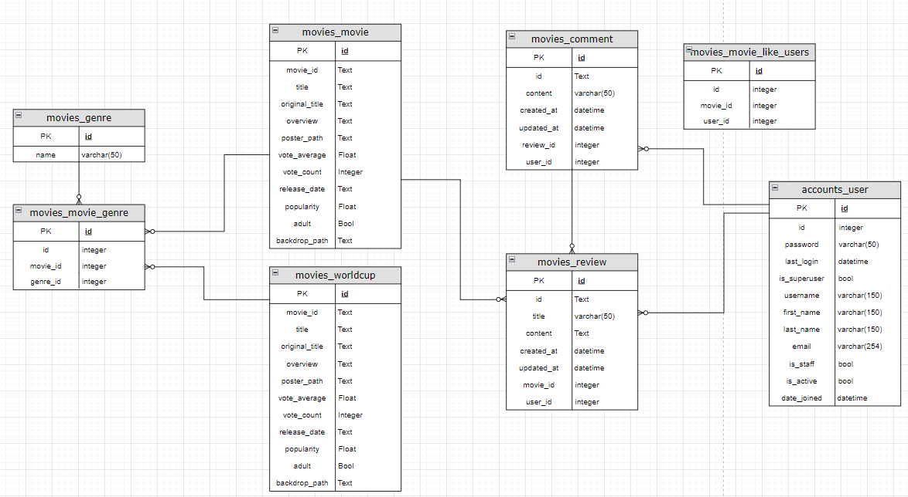

### 🎬영화 추천 플랫폼 구현 project

# ☁️ WWM : Weather-With-Movie

## 1. 팀원

| 이름   | 역할 및 업무                                                                         |
| ------ | ------------------------------------------------------------------------------------ |
| 손민영 | - Back-end \| Django 서버 구현, 알고리즘 구현 - Front-end \| 세부 CSS 및 퍼블리싱 |
| 신종혁 | - Front-end \| Vue 클라이언트 구현 - Back-end \| 데이터 수집                      |

##

## 2. 프로젝트 소개

- 2023.05.17(수) ~ 2023.05.26(금)
- 영화 추천 알고리즘 기반 커뮤니티 서비스

### 프로젝트 목표

- 영화 데이터 기반 추천 서비스 구성
- 영화 추천 알고리즘 구성
- 커뮤니티 서비스 구성
- 서비스 관리 및 유지보수

##

## 3. 기술 스택

### 개발 Tool

- Back-end : Python, Django REST Framework, Django-alluth, Django-cors-headers
- DB : SQLite
- Front-end : Vue.js, Vuex, CSS

### 협업 Tool

- Gitlab
- Notion

##

## 4. 데이터베이스 모델링

### ERD

## 5. 프로젝트 주요 기능

### 주요 기능

- 영화 데이터 기반 추천 서비스
  - 전체 영화 목록
  - 영화 검색
- 알고리즘 기반 영화 추천 서비스
  - 오늘의 영화
  - 인기 영화
  - 날씨 기반 추천 영화
- 커뮤니티
  - 영화 리뷰 게시글 및 댓글 CRUD
  - 영화 좋아요
- 추가 페이지
  - 현재 위치 날씨
  - 영화 월드컵
- 서비스 관리 및 유지 보수
  - 웹 페이지 속도
  - 페이지 오류

##

## 6. 상세 페이지

### 6-1. 첫 화면 & 로그인/회원가입 화면

<b>첫 화면 & 로그인 화면</b>

- 로그인을 해야만 이용할 수 있는 서비스로, sign up 버튼 클릭 시 회원가입 창 연결
- 정확한 정보를 입력하지 않으면 alert를 통해 정확한 정보를 입력하도록 안내

  

###

<b>회원가입 화면</b>

- id, password 각각 알맞은 형태의 정보를 입력
  

##

### 6-2. 메인 & 인트로 페이지

<b>메인 화면</b>

- 로그인 후 나타나는 화면
- 현재 위치와 날씨 안내
- 메뉴 안내
  

###

<b>인트로 화면</b>

- 서비스 이용 안내 페이지
  

##

### 6-3. 영화 데이터 기반 추천 서비스

<b>영화 전체 목록 화면</b>

- 약 1000여 개의 영화 전체 목록
- "더보기" 버튼을 통해 20개의 영화씩 추가로 확인 가능하도록 하여 로딩 속도 단축
- ▲ 버튼 클릭시 페이지 상단으로 이동
  

###

<b>영화 검색 화면</b>

- 영화 검색 가능
- 띄어쓰기 / 순서 제한 없이 검색
  

##

### 6-4. 알고리즘 기반 영화 추천 서비스

<b>오늘의 영화 화면</b>

- 약 1000개의 영화 중 랜덤으로 오늘의 영화를 추천
- 영화의 포스터, 제목, 평점, 개봉일자 확인 가능
  

###

<b>인기영화 화면</b>

- 약 1000여개의 영화 중 관객 수 기준으로 인기 영화 목록 제공
- 포스터 토글 시 제목, 줄거리, 개봉일자 확인 가능
- 포스터 클릭 시 영화 세부 내용
  

###

<b>날씨 기반 추천 영화 화면</b>

- 현재 날씨를 기반으로 영화 추천
- 예) 맑은 날 -> 로맨스, 애니메이션 등
  

##

### 6-5. 커뮤니티

<b>영화 리뷰 기능</b>

- 영화에 대한 리뷰 CRUD 기능 제공
- 본인의 아이디 일때만 수정/삭제 가능
  

###

<b>영화 리뷰 댓글 기능</b>

- 영화에 대한 리뷰 댓글 CRUD 기능 제공
- 본인의 아이디 일때만 수정/삭제 가능
  

###

<b>영화 좋아요 기능</b>

- ♥ 버튼 클릭시 영화 '좋아요'
- '좋아요' 한 영화는 'LIKED'에서 확인 가능
- ♥ 버튼 재클릭시 '좋아요' 목록에서 삭제
  

##

### 6-6. 추가 기능

<b>영화 월드컵 기능</b>

- '좋아요' 순으로 상위 64개 영화를 통해 16강 / 8강 선택
- 두 영화 중 하나를 골라 최종 영화 선택
  
